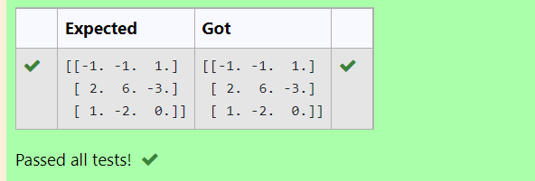

# INVERSE-OF-A-MATRIX
## Aim:
To write a python program to find the inverse of a matrix
## Equipment’s required:
1. 	Hardware – PCs
2. 	Anaconda – Python 3.7 Installation / Moodle-Code Runner
## Algorithm:
### Step1 : 
Import numpy library
### Step 2: 
Assign the values to the arrays created
### Step 3: 
Using the np.linalg.inv() we can find the inverse of the matrix
### Step 4: 
End the program

## Program:
```
Inverse of a matrix
Name: Barath S
Register no: 22008643
```
```python
import numpy as np
a = np.array([[6,2,3],[3,1,1],[10,3,4]])
b = np.linalg.inv(a)
print(b)
```
## Output:

## Result:
Thus the inverse of given matrix is successfully solved using python program

